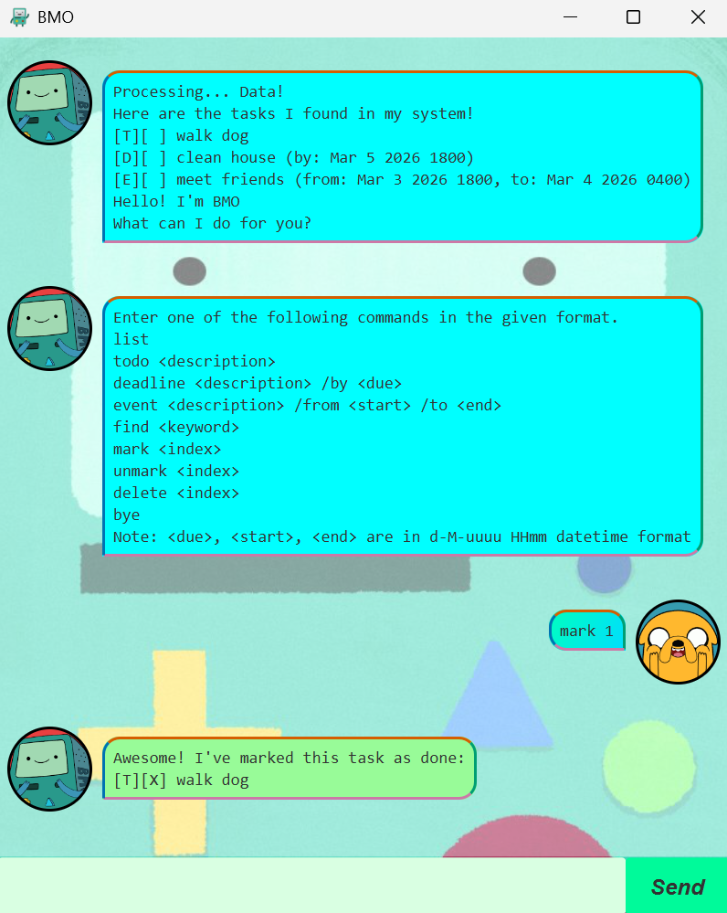
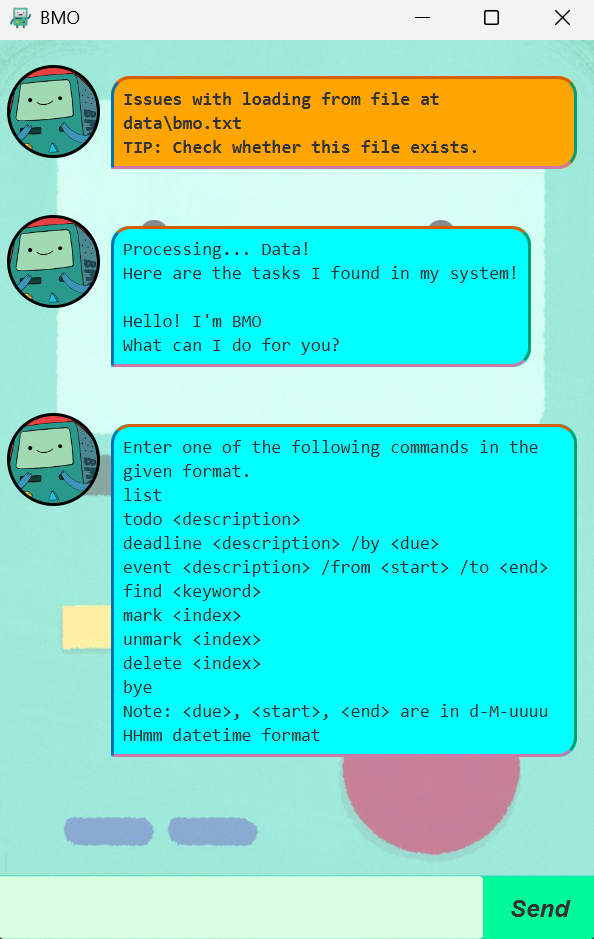

# BMO User Guide



Have you been 
* struggling to do your... todos? 
* missing deadlines left and right? 
* forgetting to show up for events?

If this is you, fret not. BMO is here to handle your endless list of tasks for you!

BMO is a desktop app for managing tasks, optimized for use via a Command Line Interface (CLI), while still having benefits of a Graphical User Interface (GUI). If you can type fast, BMO can save you time, effort and give you a peace of mind as you smash through your list of tasks!

* Quick start
* Features
  * Adding a todo task: `todo`
  * Adding a deadline task: `deadline`
  * Adding an event task: `event`
  * Listing all tasks: `list`
  * Finding a task by keyword: `find`
  * Marking a task as done: `mark`
  * Marking a task as not done: `unmark`
  * Deleting a task: `delete`
  * Listing command summary: any other command word
  * Exiting the program: `bye`
  * Saving the data
  * Editing the data file
* FAQ
* Known issues
* Command summary

## Quick start

1. Ensure you have Java `17` or above installed in your laptop or PC.
**Mac users:** Ensure you have the precise JDK version prescribed [here](https://se-education.org/guides/tutorials/javaInstallationMac.html).


2. Download the latest `.jar` file from [here](https://github.com/ram-nush/ip/releases).


3. Copy the file to the folder you want to use as the home folder for your BMO chatbot.


4. On a file manager app, navigate to the folder you put the jar file in. Right-click and select an option which resembles *'Open in Terminal'*.


5. Use the `java -jar bmo.jar` command to run the application. A GUI similar to the one below should appear in a few seconds.




Notice how the app mentions that there are issues loading from file. The reason is that there is no save file yet. This is expected during your first use of the app.

6. Type the command in the command box (bottom-left) and press Enter to execute it. e.g. typing `list` and pressing Enter will show the current list of tasks.

   Some example commands you can try:
   * `list`: Lists all tasks.
   * `todo read book`: Adds a todo task named `read book` to the list of tasks.
   * `mark 2`: marks the 2nd task in the list as done.
   * `bye`: saves the current list of tasks and exits the app.

7. Refer to the [Features](#features) below for details of each command.

---

## Features

> [!NOTE]
> Words in `<>` are the parameters to be supplied by the user.
>
> e.g. in `todo <description>`, `description` is a parameter which can be used as in `todo read book`.

### Adding a todo task: `todo`

You can add tasks with no other information, using the `todo` command. You just need the task description.

Format: `todo <description>`<br>
Example: `todo read book`

```
Another task? I'll make space for this task:
[T][ ] read book
Now you have 1 tasks.
```

### Adding a deadline task: `deadline`

You can also add tasks which have deadlines, using the `deadline` command. You would need the task description as well as the date and time the task is due.

The date and time need to be in a standard datetime format: `d-M-uuuu HHmm`. <br>
Here are some examples of datetimes which match the input format:<br>
`5-3-2026 1500`, `06-03-2026 2300`, `12-9-2026 0000`

Format: `deadline <description> /by <due>`<br>
Example: `deadline clean house /by 5-3-2026 1800`

```
Another task? I'll make space for this task:
[D][ ] clean house (by: Mar 5 2026 1800)
Now you have 2 tasks.
```

### Adding an event task: `event`

Additionally, you can add tasks which have a start and an end, using the `event` command. You would need the task description, the date and time the task starts and ends.

Similar to deadline tasks, the date and time need to be in the same datetime format: `d-M-uuuu HHmm`.<br>
Please ensure that your start date and time is not after your end date and time. Otherwise, BMO will not let you add this event.

Format: `event <description> /from <start> /to <end>`<br>
Example: `event meet friends /from 3-3-2026 1800 /to 4-3-2026 0400`

```
Another task? I'll make space for this task:
[E][ ] meet friends (from: Mar 3 2026 1800, to: Mar 4 2026 0400)
Now you have 3 tasks.
```

> [!TIP]
> Experienced users may omit the spaces between parameters.
>
> e.g. if the command specifies `deadline clean house/by5-3-2026 1800`,
> it is interpreted as `deadline clean house /by 5-3-2026 1800`

### Listing all tasks: `list`

You can list the current tasks stored in BMO's system.

Format: `list`

```
Look at all these tasks!
1. [T][ ] read book
2. [D][ ] clean house (by: Mar 5 2026 1800)
3. [E][ ] meet friends (from: Mar 3 2026 1800, to: Mar 4 2026 0400)
```

### Finding a task by keyword: `find`

You can find the tasks where their descriptions match the given keyword.

Format : `find <keyword>`<br>
Example: `find friend`

* The search is case-insensitive. e.g. `Book` in description will match the `book` keyword.
* The search ignores symbols and spaces unless the keyword only contains symbols. e.g. `todo` keyword will be matched by `to do`, `to-do`, `TO.DO` in descriptions.
* The search is a partial match, meaning all descriptions which contain a prefix of the keyword will be returned. e.g. `hello` keyword will be matched by `helmet`, `heart` and `home` in descriptions.

```
These tasks might be what you are looking for:
1. [E][ ] meet friends (from: Mar 3 2026 1800, to: Mar 4 2026 0400)
```

### Marking a task as done: `mark`

Once the task is complete, you can mark a task as done. You need the index of the task. The index refers to the number shown beside the task in the list. The index must be a positive integer from 1 to the total number of tasks.

Format : `mark <index>`<br>
Example: `mark 2`

```
Awesome! I've marked this task as done:
[D][X] clean house (by: Mar 5 2026 1800)
```

### Marking a task as not done: `unmark`

If you decide that the task has not been completed, you can mark a task as not done. You need the index of the task.

Format : `unmark <index>`<br>
Example: `unmark 2`

```
Oh no, I've marked this task as not done yet:
[D][ ] clean house (by: Mar 5 2026 1800)
```

### Deleting a task: `delete`

If you don't want to see a task again, you can delete it from the list. You need the index of the task.

Format : `delete <index>`<br>
Example: `delete 1`

```
More space for me! I've removed this task:
[T][ ] read book
Now you have 2 tasks.
```

### Listing command summary: any other command word

If you are not sure of what commands you can use, you can enter any command word which does not match any of the command words. A command word is the first word of a command (separated by space).

This will list the format of each command.

Format : `<any word other than the ones mentioned>`<br>
Example: `bmo`

```
I am limited by my programming to understand what you are saying. Please try again!
bmo is not a valid command type!
TIP: Enter one of the following commands in the given format.
list
todo <description>
deadline <description> /by <due>
event <description> /from <start> /to <end>
find <keyword>
mark <index>
unmark <index>
delete <index>
bye
Note: <due>, <start>, <end> are in d-M-uuuu HHmm datetime format
```

### Exiting the program: `bye`

When you are done updating your tasks, you may exit the program. BMO will save the list of tasks and show them to you before exiting.

Format : `bye`

```
The following tasks will be stored in my system!
D | 0 | clean house | Mar 5 2026 1800
E | 0 | meet friends | Mar 3 2026 1800 | Mar 4 2026 0400

Battery low. Shutdown.
```

### Saving the data

The list of tasks are saved to a data file, on entering the `bye` command.

If you made changes in the app and do not wish to save them, you may close the app using the X button.

### Editing the data file

Task data are saved as a text file `[JAR file location]/data/bmo.txt`. Experienced users are welcome to update data directly by editing that data file.

> [!CAUTION]
> If your changes to the data make its format invalid, BMO will identify such lines as corrupted. During the next startup, BMO will remind you to save these lines somewhere else, otherwise they will be overwritten with the current list of tasks.
> 
> BMO is smart enough to retrieve the lines with valid format to show the user.

---

## FAQ

**Q**: How do I transfer my data to another laptop or PC?<br>
**A**: Download the jar file in the other laptop / PC. Create a data folder within the same folder as the jar file and place your text file inside the data folder.

---

## Known issues

* **Editing the data file to have the start date and time of an event be after the end date and time of the event**: On the next startup, BMO simply reads this event, without checking for this condition.
* **When the user has one task, messages still use the plural form**: e.g. "Now you have 1 tasks."

---

## Command summary

| Action              | Format, Examples                                                                                                 |
|---------------------|------------------------------------------------------------------------------------------------------------------|
| **Add Todo**        | `todo <description>`<br>e.g. `todo read book`                                                                    |
| **Add Deadline**    | `deadline <description> /by <due>`<br>e.g. `deadline clean house /by 5-3-2026 1800`                              |
| **Add Event**       | `event <description> /from <start> /to <end>`<br>e.g. `event meet friends /from 3-3-2026 1800 /to 4-3-2026 0400` |
| **List**            | `list`                                                                                                           |
| **Find**            | `find <keyword>`<br>e.g. `find friend`                                                                           |
| **Mark**            | `mark <index>`<br>e.g. `mark 2`                                                                                  |
| **Unmark**          | `unmark <index>`<br>e.g. `mark 2`                                                                                |
| **Delete**          | `delete <index>`<br>e.g. `mark 2`                                                                                |
| **Command Formats** | any other command word                                                                                           |
| **Exit**            | `bye`                                                                                                            |
